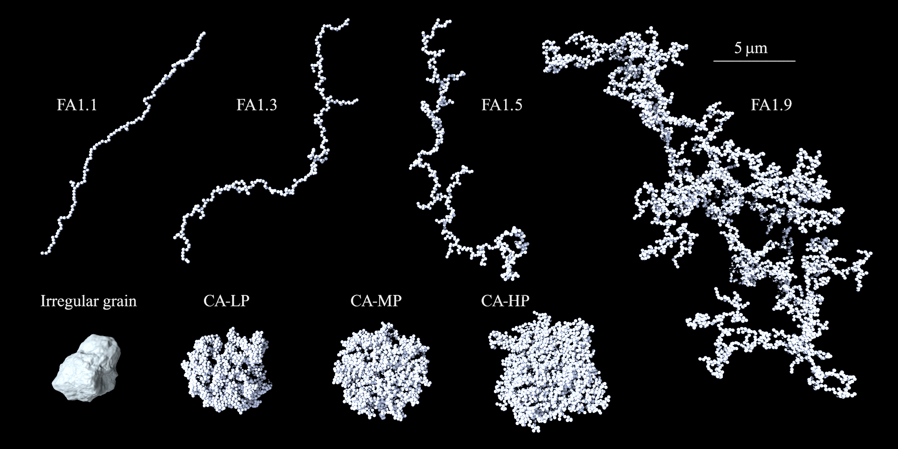
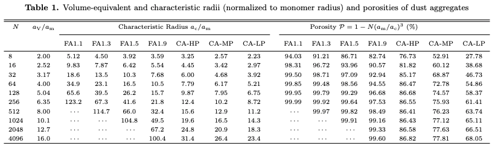
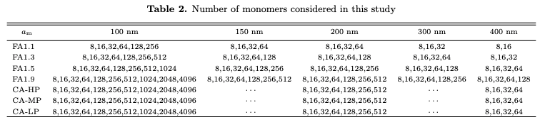
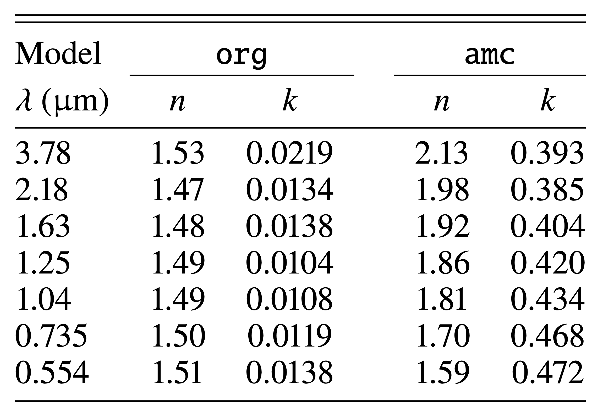

Dust models
===========================

Summary of dust models and their properties
###########################################

Shape models
*************
We consider seven types of dust aggregates and one type of solid irregular grains, as shown in the image below.

In ``AggScatVIR``, each particle shape can be called by a command listed below:

+------------+---------------------------------------------------+
| cmd        | Meaning                                           |
+============+===================================================+
| ``FA11``   | Fractal aggregates with                           |
|            | :math:`D_\mathrm{f}=1.1,~k_\mathrm{f}=1.7`        |
+------------+---------------------------------------------------+
| ``FA13``   | Fractal aggregates with                           |
|            | :math:`D_\mathrm{f}=1.3,~k_\mathrm{f}=1.5`        |
+------------+---------------------------------------------------+
| ``FA15``   | Fractal aggregates with                           |
|            | :math:`D_\mathrm{f}=1.5,~k_\mathrm{f}=1.4`        |
+------------+---------------------------------------------------+
| ``FA19``   | Fractal aggregates with  :math:`D_\mathrm{f}=1.9` |
|            | (also known as BCCA)                              |
+------------+---------------------------------------------------+
| ``CAHP``   | Compact aggregates with a high porosity           |
|            | (also known as BPCA)                              |
+------------+---------------------------------------------------+
| ``CAMP``   | Compact aggregates with a moderate porosity       |
|            | (also known as BAM1)                              |
+------------+---------------------------------------------------+
| ``CALP``   | Compact aggregates with a low porosity            |
|            | (also known as BAM2)                              |
+------------+---------------------------------------------------+
| ``grs``    | Irregular compact grains                          |
|            | (also known as GRS)                               |
+------------+---------------------------------------------------+

Size and Porosity
******************

Table 1 summarizes the volume-equivalent radius and the characteristic radius of aggregates (normalized to the monomer radius) provided in ``AggScatVIR`` (see :ref:`definition` for the detailed definitions of these quantities).

   
The monomer radius and the number of monomers used in ``AggScatVIR`` are summarized in Table 2.

Composition
******************

We consider two sets of dust composition. Please refer to `Tazaki \& Dominik (2022) <https://ui.adsabs.harvard.edu/abs/2022A%26A...663A..57T>`_ for a detailed description. The following command can call each.

+---------+------------------------------------------------------------------+
| cmd     | dust composition                                                 |
+=========+==================================================================+
| ``org`` | pyroxene (Mg0.7Fe0.3SiO3), water ice, troilite, organics         |
+---------+------------------------------------------------------------------+
| ``amc`` | pyroxene (Mg0.7Fe0.3SiO3), water ice, troilite, amorphous carbon |
+---------+------------------------------------------------------------------+

The refractive index of each dust composition is as follows.

How to read file names?
##########################

For aggregates
*******************

The name of each dust model obeys::

    dustkapscatmat_TYPE_AGGSIZE_MONOSIZE_MONOCOMP.inp

where ``TYPE`` specifices a type of particle shape, ``AGGSIZE`` is the aggregate size, ``MONOSIZE`` is the monomer radius in unit of nm, and ``MONOCOMP`` is the dust composition. For example::

    dustkapscatmat_FA19_4096_100nm_amc.inp

Fractal aggregates with :math:`D_\mathrm{f}=1.9` consisting of 4096 monomers; each monomer has a radius of 100 nm and a ``amc`` composition.

``AggScatVIR`` also offers the optical properties averaged over an aggregate-size distribution obeying 

.. math::
   n(a_\mathrm{V})da_\mathrm{V}\propto a_\mathrm{V}^{-3.5}da_\mathrm{V}~(a_\mathrm{min}\le a_\mathrm{V}\le a_\mathrm{max}),

where :math:`a_\mathrm{min}` and :math:`a_\mathrm{max}` represent the minimum and maximum volume-equivalent radii, respectively. For the aggregates, the minimum aggregate radius is set as :math:`a_\mathrm{min}=2a_\mathrm{mon}`. The maximum aggregate radius is a parameter. The file name for the distribution-averaged optical properties looks like this::

    dustkapscatmat_FA19_Nmax4096_100nm_amc.inp

where ``Nmax4096`` represents that the maximum aggregate in the size distribution contains 4096 monomers.

.. +-----------+----------------------------------------+-------------------------+-------------------------+--------------------+----------------+
    |           | ``MONOSIZE=100nm``                     | ``150nm``               |  ``200nm``              | ``300nm``          | ``400nm``      |
    +===========+========================================+=========================+=========================+====================+================+
    | ``FA11``  | 8,16,32,64,128,256                     | 8,16,32,64              |  8,16,32,64             | 8,16,32            | 8,16           |
    +-----------+----------------------------------------+-------------------------+-------------------------+--------------------+----------------+
    | ``FA13``  | 8,16,32,64,128,256,512                 | 8,16,32,64,128          |  8,16,32,64,128         | 8,16,32,64         | 8,16,32        |
    +-----------+----------------------------------------+-------------------------+-------------------------+--------------------+----------------+
    | ``FA15``  | 8,16,32,64,128,256,512,1024            | 8,16,32,64,128,256      |  8,16,32,64,128,256     | 8,16,32,64,128     | 8,16,32,64     |
    +-----------+----------------------------------------+-------------------------+-------------------------+--------------------+----------------+
    | ``FA19``  | 8,16,32,64,128,256,512,1024,2048,4096  | 8,16,32,64,128,256,512  |  8,16,32,64,128,256,512 | 8,16,32,64,128,256 | 8,16,32,64,128 |
    +-----------+----------------------------------------+-------------------------+-------------------------+--------------------+----------------+
    | ``CAHP``  | 8,16,32,64,128,256,512,1024,2048,4096  | ...                     |  8,16,32,64,128,256,512 | ...                | 8,16,32,64     |
    +-----------+----------------------------------------+-------------------------+-------------------------+--------------------+----------------+
    | ``CAMP``  | 8,16,32,64,128,256,512,1024,2048,4096  | ...                     |  8,16,32,64,128,256,512 | ...                | 8,16,32,64     |
    +-----------+----------------------------------------+-------------------------+-------------------------+--------------------+----------------+
    | ``CALP``  | 8,16,32,64,128,256,512,1024,2048,4096  | ...                     |  8,16,32,64,128,256,512 | ...                | 8,16,32,64     |
    +-----------+----------------------------------------+-------------------------+-------------------------+--------------------+----------------+

.. The raddius of an aggregate depends on the number of monomers, monomer radius, and aggregate type. The list of aggregate radius is summarized as follows.
    .. image:: ./imgs/table1.png

For irregular grains
**********************

For irregular grains, the name of dust model obeys::

    dustkapscatmat_grs_rvSIZEum_comp.inp

| where ``SIZE`` is a volume-equivalent radius of irregular grains in unit of microns. 
| ``SIZE`` = ``0_2000``, ``0_2520``, ``0_3175``, ``0_4000``, ``0_5040``, ``0_6350``, ``0_8000``, ``1_0079``, ``1_2699``, ``1_6000``

As with the case of aggregates, we also prepared the optical properties averaged over the size distribution. In this case, the file name looks like this::
    
    dustkapscatmat_grs_rvmaxSIZEum_comp.inp

